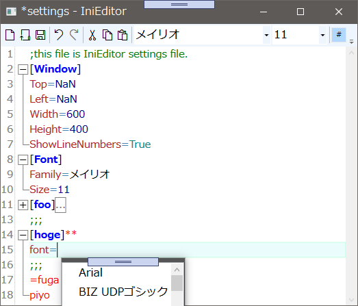

# IniEditor

## 概要
INIファイルエディタという想定で、
* 強調表示
* 折り畳み
* コード補完機能

を使用したサンプルアプリ。

## 強調表示
* コメント（Green）
* セクション名（Bold Blue）
* キー名（Firebrick）
* 最初のイコール（SteelBlue）
* 数値（DarkBlue）
* bool（DarkCyan）
* エラー（Red）
  * セクション前後の文字
  * キーなし
  * イコールなし

## 折り畳み
セクション単位で折り畳む。

## コード補完
familyかfontが含まれる行で`=`を打った時に、インストールされているフォントをサジェストする。

## ライセンス
CC0 1.0 Universal

## 注意事項
* サンプルなので実用しないでください
* 一切責任は持ちません

## 謝辞
[AvalonEdit - Copyright (c) AvalonEdit Contributors](http://avalonedit.net/)
[IniWrapper - Copyright (c) 2018 Piotr Szkudlarski](https://github.com/Szpi/IniWrapper/wiki)
